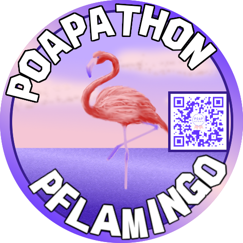

# POAPathon Pflamingo

Given the Hollywood theme of the provided assets, POAPathon Pflamingo represents the wide ranging collaboration inherent in the flamingo's native range: from the American West coast in California, the East Coast in Florida, to Central America, the Caribbean, South America, Africa, the Middle East, Europe, and Asia.

## Design

POAPathon Pflamingo's design is a juxtaposition of the conventional art themes with classic painting styles and the decentralized, interconnected modern world: QR Codes, remote collaboration, cryptocurrency, NFTs, Hollywood, and digital art.

## Image descriptions

Two version of the design are provided, as well as the frame.

POAPathon Pflamingo at a distance, with or without event QR Code:
-POAPathon_Pflamingo_QR_Code_Bordered.png
-POAPathon_Pflamingo.png

POAPathon Pflamingo's Hollywood headshot, with or without event QR Code:
-POAPathon_Pflamingo_Headshot_QR_Code.png
-POAPathon_Pflamingo_Headshot.png

POAPathon Pflamingo frame:
-POAPathon_Pflamingo_Frame.png
