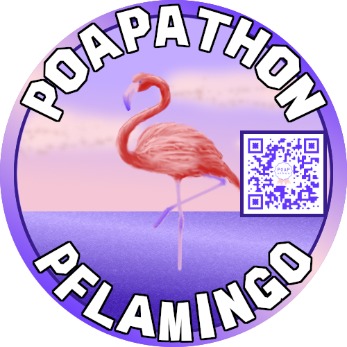

# POAPathon Pflamingo

Given the Hollywood theme of the provided assets, POAPathon Pflamingo connects from the American West coast in California to the wide ranging collaboration represented by the flamingo's native range: the East Coast in Florida, Central America, the Caribbean, South America, Africa, the Middle East, Europe, and Asia.

## Design

POAPathon Pflamingo's design is a juxtaposition of the conventional art themes with classic painting styles and the decentralized, interconnected modern world: QR Codes, remote collaboration, cryptocurrency, NFTs, Hollywood, and digital art.

## Image descriptions

Two version of the design are provided, as well as the frame.

POAPathon Pflamingo at a distance, with or without event QR Code:
- [POAPathon_Pflamingo_QR_Code_Bordered](POAPathon_Pflamingo_QR.png)
- [POAPathon_Pflamingo](POAPathon_Pflamingo.png)

POAPathon Pflamingo's Hollywood headshot, with or without event QR Code:
- [POAPathon_Pflamingo_Headshot_QR_Code](POAPathon_Pflamingo_Headshot_QR.png)
- [POAPathon_Pflamingo_Headshot](POAPathon_Pflamingo_Headshot.png)

POAPathon frame, with or without event QR Code:
- [POAPathon_Pflamingo_Frame_QR](POAPathon_Frame_QR.png)
- [POAPathon_Pflamingo_Frame](POAPathon_Frame_.png)
